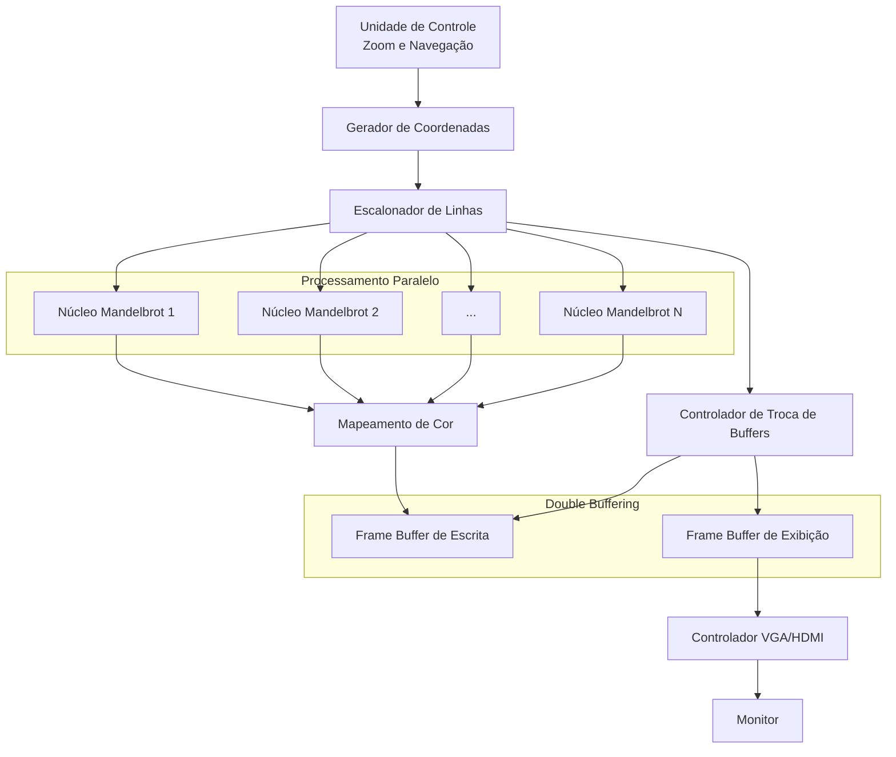

# Proposta de Projeto Final - Geração do Conjunto de Mandelbrot

## a) Descrição Simplificada do Projeto

O projeto consiste na implementação de um gerador gráfico do Conjunto de Mandelbrot. O sistema realizará os cálculos matemáticos necessários para determinar se cada ponto do plano complexo pertence ou não ao conjunto, gerando uma imagem em tempo real exibida em um monitor VGA.

A FPGA será responsável por executar os cálculos iterativos, explorando o paralelismo inerente da arquitetura para acelerar significativamente a geração da imagem. O sistema permitirá a visualização do fractal e a navegação por ele, com zoom e deslocamento da área visualizada.

## b) Objetivos a Serem Atingidos

- Desenvolver o algoritmo iterativo do Conjunto de Mandelbrot na FPGA.
- Exibir o fractal em um monitor externo.
- Permitir interação do usuário através de botões ou chaves da FPGA para controle de zoom e movimentação da imagem.

## c) Diagrama de Blocos do Projeto

O sistema é composto por uma unidade de controle responsável pela atualização dos parâmetros de navegação, como deslocamento horizontal, deslocamento vertical e nível de zoom. A partir desses parâmetros, um gerador de coordenadas converte as posições dos pixels em pontos do plano complexo, sem a necessidade de armazenar previamente as coordenadas de cada pixel. Um escalonador distribui dinamicamente as linhas da imagem entre múltiplos núcleos Mandelbrot, que executam os cálculos em paralelo e geram os valores RGB correspondentes. Os resultados são armazenados em um Frame Buffer de escrita, enquanto o controlador VGA realiza a leitura contínua de um segundo Frame Buffer de exibição para apresentar a imagem no monitor. Após a conclusão do cálculo de um novo quadro, os buffers são trocados, permitindo a atualização da imagem de forma contínua.

### Descrição dos Blocos

- **Unidade de Controle:** coordena o funcionamento geral do sistema, processando as entradas do usuário e atualizando os parâmetros de navegação, como posição e nível de zoom da visualização.
- **Gerador de Coordenadas:** converte as posições dos pixels da tela em coordenadas do plano complexo com base nos parâmetros atuais de navegação.
- **Escalonador de Linhas:** distribui dinamicamente as linhas da imagem entre os núcleos Mandelbrot disponíveis, garantindo o balanceamento da carga de processamento.
- **Núcleos Mandelbrot:** executam, em paralelo, as iterações do algoritmo de Mandelbrot para os pixels das linhas atribuídas, determinando a quantidade de iterações necessária para cada ponto.
- **Mapeamento de Cor:** converte o número de iterações calculado para cada ponto em valores RGB utilizados na geração da imagem.
- **Frame Buffer de Escrita:** armazena os valores RGB produzidos pelos núcleos Mandelbrot durante a geração de um novo quadro.
- **Frame Buffer de Exibição:** armazena a imagem atualmente exibida no monitor, permitindo que a visualização permaneça estável enquanto um novo quadro é calculado.
- **Controlador VGA/HDMI:** realiza a leitura sequencial do Frame Buffer de Exibição e gera os sinais de vídeo necessários para a apresentação da imagem no monitor.
- **Controlador de Troca de Buffers:** monitora a quantidade de linhas concluídas pelos núcleos Mandelbrot e, quando todas as linhas do quadro forem processadas, realiza a alternância entre os buffers de escrita e exibição, garantindo a atualização contínua da imagem.

## d) Testes a Serem Feitos para Validação

A validação do projeto será realizada por meio da comparação entre as imagens geradas pela FPGA e uma implementação de [referência em software](https://mandelbrot.site/). Serão testadas as funcionalidades de navegação horizontal, vertical e zoom em diferentes regiões do Conjunto de Mandelbrot, verificando se as imagens obtidas apresentam comportamento parecido com a referência.